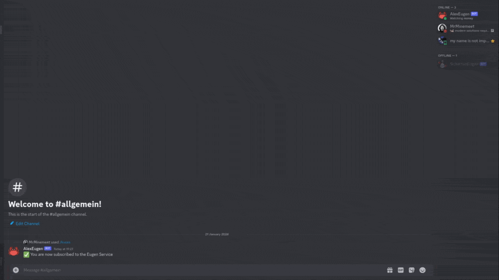
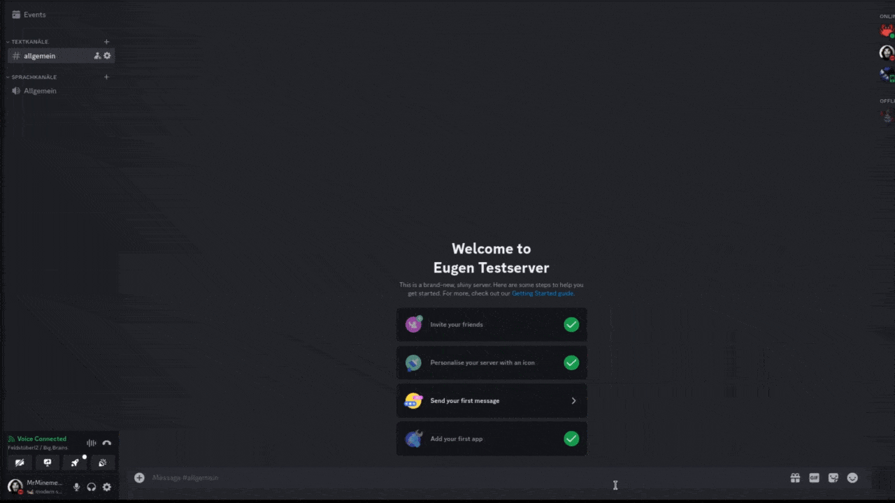
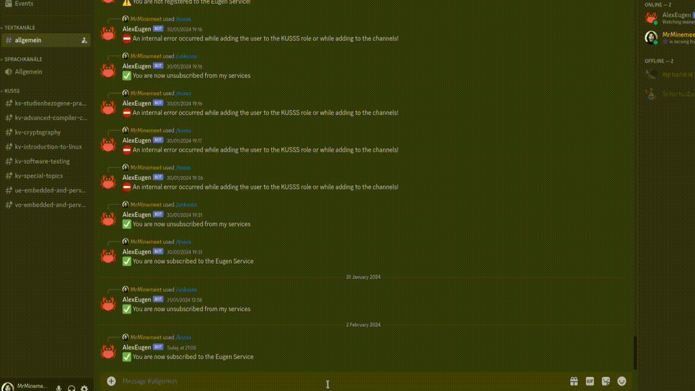
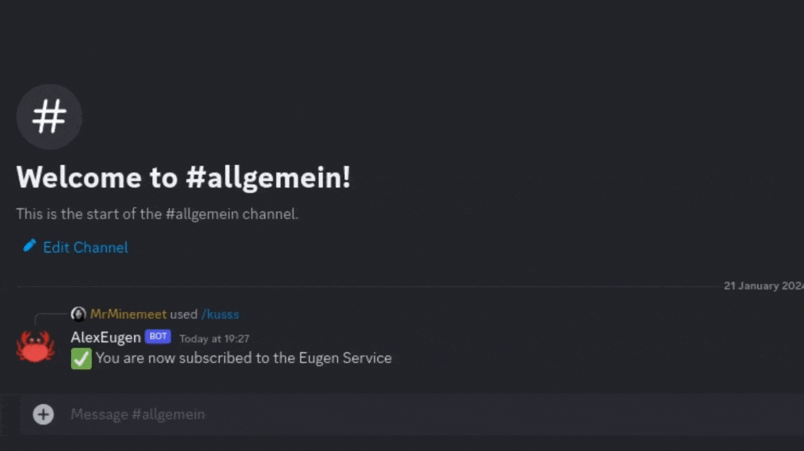
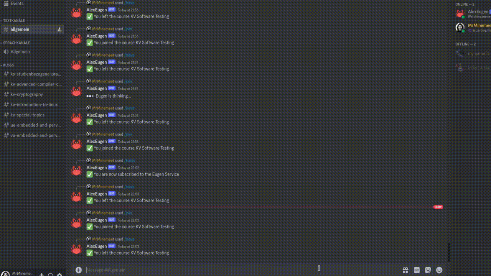
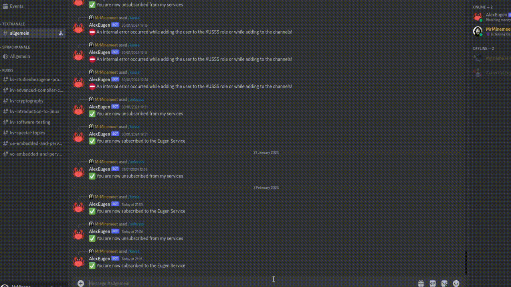

# Eugen

Eugen is the successor to the sadly abandoned [Kilian](https://github.com/rechen-werk/Kilian) Discord Bot. After facing some issues with the old codebase, we decided to start from scratch and build a new bot in a more suited and modern language that is based on the JVM. Eugen is written in Kotlin instead of Python and should provide the same features and fix some issues that were present in Kilian.

**So what does Eugen do?**

Well, Eugen manages course channels based on KUSSS data like a good old restaurant under the sea 😉. This means that he creates channels for every course a user attends attend and assigns them using member permissions.
Another perk of using Eugen is that a user can join a course channel with a simple command. 

With all this automation you don't have to focus on managing your server and can focus on the important things in life, such as "studying", sleeping or making memes.

# Usage
**Note:** Commands marked with a ' :safety_vest: ' are only available to users added in the `managers.txt` file.

## /sleep :safety_vest:
Gracefully puts Eugen to sleep. All remaining queued messages are sent before turning off.

## /kusss \<url\> [mat-nr]
Subscribes the user to the Eugen Service. 
* The `url` is the link to the calendar file of [KUSSS](https://kuss.jku.at). The data is fetched, parsed and used to assign the corresponding LVA channels.
* The optional `mat-nr` is the student's matriculation number. At this point it is optional but may be useful to know at some occasion.

## /unkusss
Unsubscribes the user from the Eugen Service. Furthermore, any user-specific data stored is deleted.

## /matnr <@user>
Retrieves the matriculation number of the user. This is only possible if the user is subscribed to the Eugen Service and stated their matriculation number.

## /reload :safety_vest:
Reloads the data from the calendar file. This action is also performed automatically every 24 hours.

## /delete-kusss :safety_vest:
Deletes the KUSSS category and all it's channels. **:rotating_light: This action is irreversible.**

## /join \<course-id\>
Allows the users to join a course channel they don't attend. This is useful for students who already passed the course but want to stay in the channel to help others.
The `course-id` is the ID of the course.

## /leave \<course-id\>
Allows the user to leave a course channel. This can be a channel they joined manually or a channel they were assigned to by Eugen.
The `course-id` is the ID of the course.

# Differences to Kilian
* `/reload` command to manually reload the calendar file and automatic reload every 24h.
* Created channels under the `KUSSS` category are sorted by their name in ascending order.
* Places KUSSS url into the channel topic.
* No explicit `/ping` command in order to mention specific users. The roles are channel based and therefore a normal `@everyone` or `@here` inside the channel is sufficient.

# How to get a working discord bot
## Requirements
The bot delivers all major dependencies in the form of a fat jar. The only requirement is a JRE.

## Create a bot account
1. Create a new bot by following [THIS](https://discordpy.readthedocs.io/en/stable/discord.html) guide. Please store your token in a safe place, as you will need it later.
2. Set all boxes in "Privileged Gateway Intents" ("Bot" page) to "on".
3. Use the URL Generator to create an invitation link for the bot.
   * Check `bot` and `applications.commands` under "Scopes"
   * Check `Administrator` under "Bot Permissions" (this is the easiest way. You can also set the permissions manually but this is not covered here)
4. Use the link at the bottom of the page to invite the bot to your server.

## Get the bot running
1. Download the latest release from [HERE](https://github.com/mrminemeet/releases).
2. Extract the archive.
3. Create a file called `managers.txt` and add your unique discord username (the name that replaced the `name#number`) to it.
4. Set the previously received token as the environment variable `EUGEN_BOT_TOKEN`.g
5. Start the bot by executing the downloaded `.jar` file with `java -jar eugen-<version>.jar`. This should start the bot and you should see Eugen being online in your server.